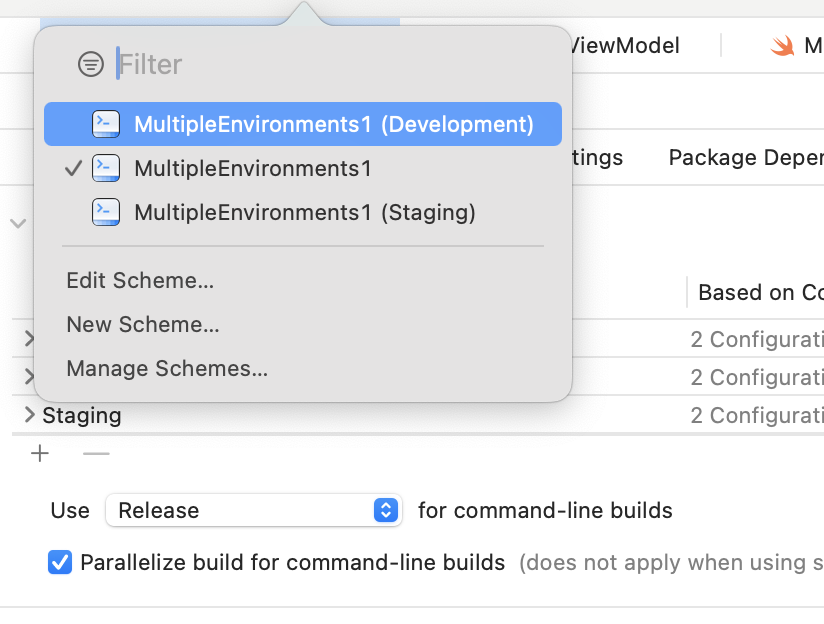
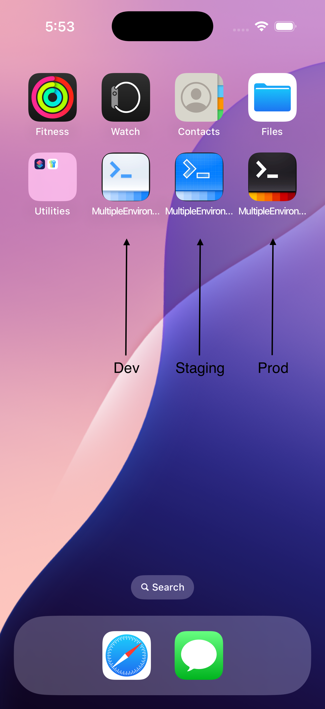

# TicTacToe App

Multi Environment with 3 modes (development, staging, production).

### Setup
This project was implemented using XCode 16 and iOS 18 deployment target.

## Summary

#### - ADVANCED APP DESIGN
The main goal to develop this simple app is demostrate the use of  Multi Environment use in a real App to avoid problems deploying new  features like:

* The API Roulette Game
  
You’re constantly commenting/uncommenting different base URLs. One day you forget to switch back to dev… and boom — you’ve created test users in your production database. Oops.

* The QA Nightmare
  
Your QA team can’t reproduce bugs because they’re testing against different data than you. Also: your “staging environment” is just… not a thing.

* The App Store Horror Show
  
You ship with debug logs enabled, hardcoded test credentials, and your analytics pointed at staging. Congrats — Apple reviewers are now seeing your internal test data 😬

* The Team Chaos Scenari
  
Different developers are working on different configs, bundle IDs, and API endpoints. Code reviews are a mess of “Wait… which environment is this even for?”

# App screens

<table style="width:100%">
  <tr>
    <td></th>
  </tr>
  <tr>
    <td></th>
  </tr>
</table>

### End
